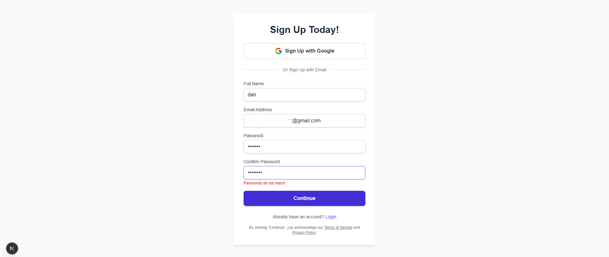
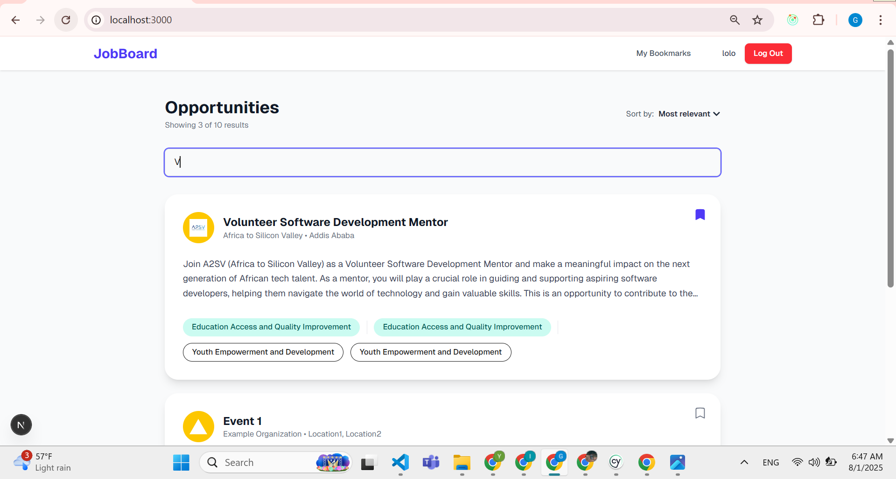
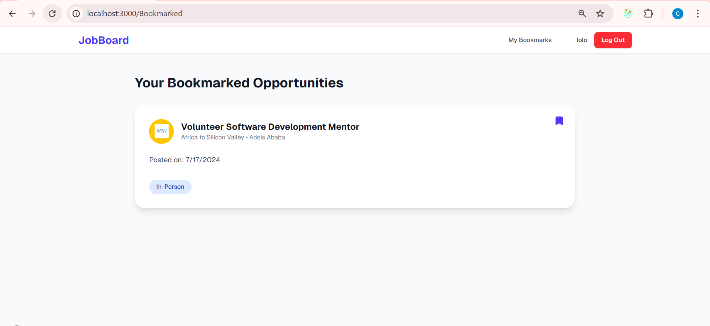
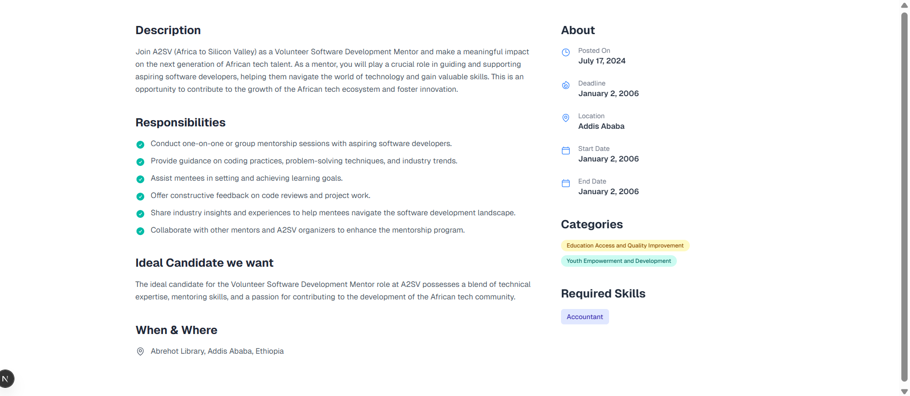
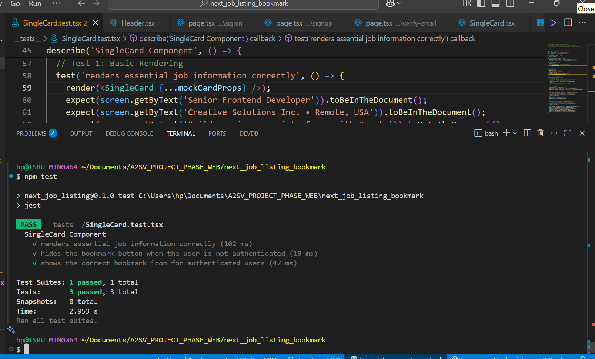
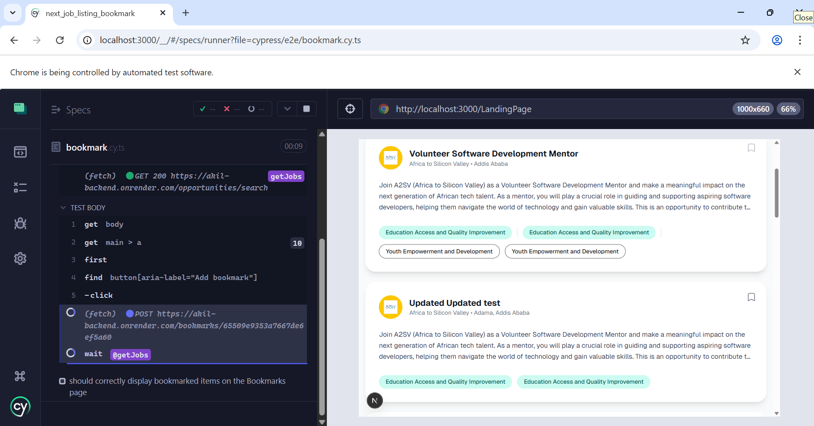
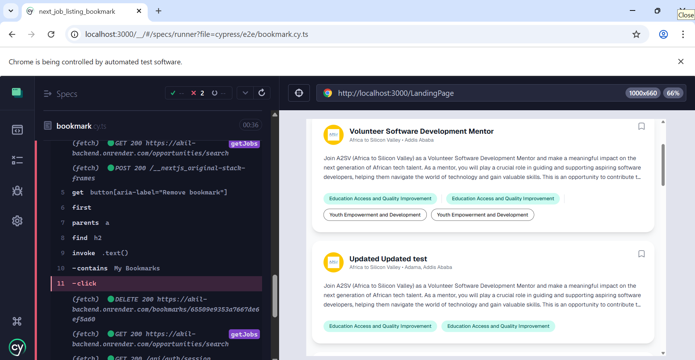

# Modern Full-Stack Job Board Application

This is a full-stack job board application built with Next.js, Redux Toolkit, and NextAuth. It features a dynamic job listing, a complete user authentication system with both credential and Google OAuth providers, and a fully functional bookmarking system for authenticated users. The project is supported by unit and end-to-end tests to ensure quality and reliability.

## Screenshots

### 1. Authentication Flow
*New or logged-out users are greeted with a public-facing page prompting them to sign in or create an account.*



### 2. Job Listings Page (Authenticated)
*After signing in, users can view and search through all available opportunities. Each card displays a bookmark icon.*


### 3. Bookmarked Jobs Page
*A dedicated, protected route where users can view all the opportunities they have saved.*


### 4. Job Detail Page
*A dynamic page providing in-depth information about a specific job opportunity.*



### 4. Testing Detail Page
*Unit test individual components, such as the `SingleCard`, in isolation. They check for correct rendering and behavior based on different props and user authentication states. *


### 5.E2E Testing Cypress 
*simulate a full user journey in a real browser. It covers the bookmarking flow, from logging in to verifying that the UI updates correctly*




---

## Features

-   **Full Authentication System:**
    -   Secure user registration and login with email/password.
    -   Seamless social sign-in/signup with Google OAuth 2.0.
    -   Email verification step for credential-based signups.
    -   Session management handled securely by NextAuth.js.
-   **Protected Routes:**
    -   Core application content (job listings, bookmarks) is accessible only to authenticated users.
    -   Auth pages (signin, signup) are accessible only to unauthenticated users.
-   **Dynamic Job Listings:**
    -   Fetches job data from a live backend API using RTK Query.
    -   Client-side search functionality to filter jobs by title in real-time.
-   **Bookmark Functionality:**
    -   Authenticated users can bookmark/unbookmark jobs from any list.
    -   A dedicated `/Bookmarked` page displays all saved jobs.
    -   UI state is automatically synchronized across pages thanks to RTK Query's caching and invalidation.
-   **Error Handling:** Custom pages for application-wide errors and 404 Not Found scenarios.
-   **Comprehensive Testing:**
    -   **Unit/Component Tests** with Jest and React Testing Library.
    -   **End-to-End (E2E) Tests** with Cypress to validate critical user flows.

## Tech Stack

-   **Framework:** [Next.js](https://nextjs.org/) 14+ (App Router)
-   **Language:** [TypeScript](https://www.typescriptlang.org/)
-   **Authentication:** [NextAuth.js](https://next-auth.js.org/)
-   **State Management:** [Redux Toolkit](https://redux-toolkit.js.org/) & [RTK Query](https://redux-toolkit.js.org/rtk-query/overview)
-   **Styling:** [Tailwind CSS](https://tailwindcss.com/)
-   **Form Handling:** [React Hook Form](https://react-hook-form.com/)
-   **Unit Testing:** [Jest](https://jestjs.io/) & [React Testing Library](https://testing-library.com/docs/react-testing-library/intro/)
-   **E2E Testing:** [Cypress](https://www.cypress.io/)

---

## Getting Started

Follow these instructions to get a copy of the project up and running on your local machine.

### Installation & Setup

1.  **Clone the repository**
    ```sh
    git clone https://github.com/Isru10/a2sv_task9.git
    
    cd a2sv_task9
    ```

2.  **Install dependencies**
    ```sh
    npm install
    ```

3.  **Set up environment variables**
    Create a file named `.env.local` in the root of your project. This file is ignored by Git and is the secure place for your secret keys.

    ```env
    # A strong, random secret for NextAuth
    NEXTAUTH_SECRET=your_super_secret_key_here

    # The base URL of your application during development
    NEXTAUTH_URL=http://localhost:3000

    # Credentials from your Google Cloud Console project
    GOOGLE_CLIENT_ID=your-google-client-id.apps.googleusercontent.com
    GOOGLE_CLIENT_SECRET=your-google-client-secret

    # The base URL for your backend API
    NEXT_PUBLIC_API_BASE_URL=https://akil-backend.onrender.com
    ```


4.  **Run the development server**
    ```sh
    npm run dev
    ```
---

## Running Tests

The project includes both unit tests and end-to-end tests to ensure code quality and functionality.

### Jest (Unit & Component Tests)

These tests validate individual components, such as the `SingleCard`, in isolation. They check for correct rendering and behavior.

To run all Jest tests:
```bash
npm test
```